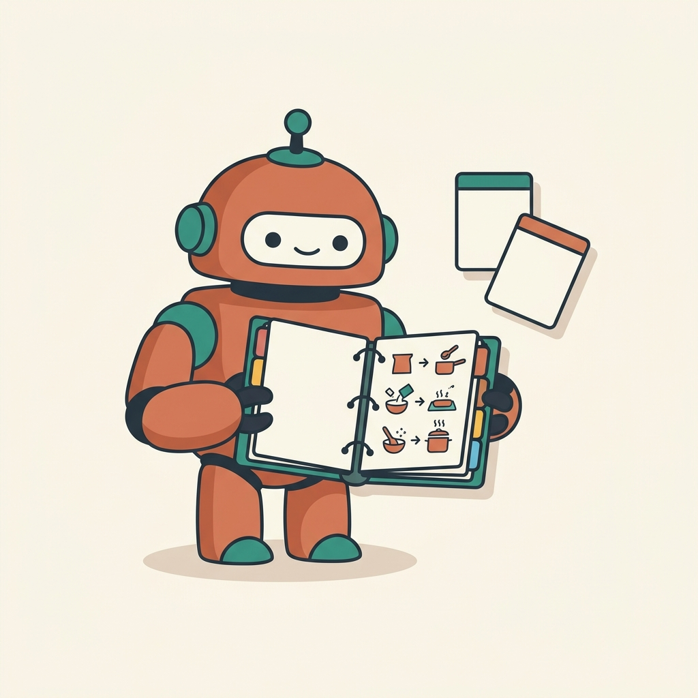

<!-- _class: title -->
<!-- _paginate: false -->

CLAUDE CODE × ショート動画 / 3時間ハンズオン

# Claude Codeでショート動画をつくる

## 台本も・素材も・音声も・編集も、AIに頼んで“動く動画”にする

by Seiya

<!-- 最初の10分：自己紹介＋今日の流れ＋完成形デモ。専門知識ゼロ前提で、気楽に。 -->

---

## 自己紹介（テンプレ・自由に書き換え）

- 名前 / ふだんやっている動画制作の仕事
- なぜこの会を開いたのか（ひとことで）
- 今日のスタンス：**「全部わからなくてOK。1本できれば勝ち」**

今日は“エンジニアになる会”ではありません。**いつもの「素材集め・編集・書き出し」を、AIに頼んで時短する**会です。

---

## 今日のゴール

**自分の手で、ショート動画を実際に1本書き出すところまで。** 
作り方の“3つの型”を、手を動かして体験します。

  
<b>① 静止画ショート</b>AIイラスト＋ナレーション 画像を並べて動画に

  
／

  
<b>② 素材ショート</b>ストック動画＋ナレーション 既存の映像を組み合わせ

  
／

  
<b>③ 切り抜きショート</b>長い動画から名場面 文字起こし＋字幕

むずかしい契約や公開設定はしません。まずは「自分のPCで動画ファイルができる」ところがゴール。

---

## 今日の流れ（3時間）

| 時間 | 内容 |
|---|---|
| 0:00–0:15 | 自己紹介・今日の流れ・**完成形デモ** |
| 0:15–0:45 | 最低限の地図（Claude Codeの言葉と仕組み） |
| 0:45–1:00 | みんなで準備（アプリ・APIキー・素材） |
| 1:00–1:45 | ハンズオン①：**静止画ショート**（AIイラスト＋ナレーション） |
| 1:45–2:15 | ハンズオン②：**素材ショート**（ストック動画＋ナレーション） |
| 2:15–2:45 | ハンズオン③：**切り抜きショート**（長い動画→名場面） |
| 2:45–3:00 | おまけ：**ブラウザ自動化**・まとめ・質問 |

正直な注意：3時間に全部を“完璧に”は入りません。①を全員でしっかり → ②③は要点デモ＋各自トライ、という構成です。**①で「作れた！」を持ち帰るのが最優先。**

---

## まず完成形を見てもらいます（デモ）

これから1〜2分。**「テーマを伝えるだけで、ナレーション付きのショートが書き出される」**ところを先に見せます。

- ゴールが見えていると、途中の作業で迷子になりません
- 「あれを自分で作るのか」という感覚を持って始めましょう
- 完成した縦型動画（9:16）を、その場で再生します

<!-- ここでSeiyaが実際に1本ライブ生成 → 再生まで見せる。 -->

---

<!-- _class: section -->
<!-- _paginate: false -->

PART 1

# 最低限の地図
### 〜言葉は“使う直前に1個ずつ”〜

---

## そもそもClaude Codeって何？

LLMネットの文章を大量に読んだ“物知りな助手”

Claudeその助手のひとり（Anthropic社製）

Claude Codeその助手に“手”を付けたもの

> ふつうのAIチャットは「答えを言う」だけ。**Claude Codeは、あなたのPCを実際に操作して、ファイルを作ったり、動画を書き出したりできる。**

---

## なぜ動画制作と相性がいい？

- **言葉で頼める**：コードや専門ソフトの操作を覚えなくていい
- **自分で手を動かす**：素材集め→音声生成→編集→書き出しまで通しでやる
- **失敗を自分で直す**：エラーが出たら原因を探して直し、もう一度試す
- **道具につながる**：MCPで画像生成・素材サイト・ブラウザにも接続

要するに「**作れる人の条件**」が、“ソフトを使いこなせる”から“**やりたいことを言葉にできる**”に変わった。

---

## Claude Codeの“頭の中”：4つの言葉

  
<b>Context window</b>いま覚えていられる量＝机の広さ

  
＋

  
<b>Agentic loop</b>考える→やる→直す＝自分で回す

  
＋

  
<b>MCP</b>外の道具に挿す＝コネクタ

  
＋

  
<b>Skills</b>作業手順書＝レシピ集

この4つだけ押さえれば、今日やることは全部「この組み合わせ」で説明できます。1個ずつ見ていきましょう。

---

## Context window（コンテキスト・ウィンドウ）

Context windowAIが“いま同時に覚えていられる”情報の広さ＝作業机の広さ

- 会話やファイルを読むほど、机の上がどんどん埋まっていく
- 机がいっぱいになると、**古い話を忘れたり、ぼんやり**してくる
- だから長い作業は、**こまめに区切る／要点を伝え直す**のがコツ

実用のコツ：話が長くなって反応が変だなと思ったら、**新しいセッションで「今やりたいこと」だけ伝え直す**。机を片付ける感覚。

---

## Agentic loop（自分で回す仕組み）

Agentic loop考える→やる→結果を見る→直す、を自分で繰り返す

  
<b>考える</b>何をすべきか

  
→

  
<b>やる</b>素材生成・書き出し

  
→

  
<b>確認</b>結果・エラー

  
→

  
<b>直す</b>必要なら修正

- 人が一手ずつ指示しなくても、ある程度**自走**する
- 動画づくりは工程が多い → ここがいちばん効く
- だから「**止める・確認する**」操作が大事になる

---

## MCP（コネクタ）とは

MCPAI用の“USB端子”。外部サービスに挿す仕組み

- Claude Code単体は「自分のPCの中」が基本
- **MCPを挿す**と、外の世界につながる
- 今日は<a href="https://elements.envato.com/">Envato</a>（素材サイト）や**ブラウザ**をMCPで操作します

イメージ：**画像生成AI・素材サイト・ブラウザ**を、AIの“手の届く範囲”に挿し込む。挿すだけで、できることが一気に増える。

---

## Skills（スキル）とは

Skillsよく使う“作業手順書”をまとめたパック

- 「この手順で動画を作って」を、あらかじめ覚えさせておけるもの
- 画面で **`/`（スラッシュ）** を打つと呼び出せる
- 毎回ゼロから説明しなくてよくなる

今日のハンズオンは、**ショート動画用のSkillsを呼び出す**のが中心。 
「①静止画」「②素材」「③切り抜き」それぞれに専用のSkillを用意しています。

---

## Agent / サブエージェント（おまけの言葉）

Agentひとつの仕事を任せられる“AIの担当者”
サブエージェント本体が、別の担当者に一部を“丸投げ”する仕組み

- 大きな作業を、**小さな担当に分けて並行**で進められる
- 例：「画像を10枚作る担当」「ナレーションを作る担当」を分ける
- 私たちは**結果を受け取るだけ**。中の細かいやり取りは見なくてOK

※ 今日は「そういう仕組みがある」程度でOK。Skillsの中で自動的に使われることがあります。

---

## Claude Codeの得意・苦手

- **得意**：素材集め・音声生成・編集の自動化／決まった手順のくり返し／試作を**速く**
- **得意**：「ちょっと直して」を何度でも（差分を見て採用/却下）

**苦手**：あいまいな丸投げ、細かい“感性の最終調整”、最新すぎる情報、権利関係の自動判断。 
→ **具体的に頼む・できた素材は自分の目で確認する**のが大事。特に**著作権／利用規約**は人間が最終チェック。

---

<!-- _class: section -->
<!-- _paginate: false -->

PART 2

# みんなで準備
### 〜道具とカギ（APIキー）をそろえる〜

---

## 今日の道具立て（全体像）

  
<b>Claude Code</b>作業の司令塔指示を出す相手

  
＋

  
<b>Remotion</b>コードで動画を組む編集ソフトの代わり

  
＋

  
<b>IrodoriTTS</b>ナレーション音声声を作る

  
＋

  
<b>素材</b>画像/動画AI生成 or ストック

これらは**プロジェクトに最初から入っています**。みなさんは「動かすカギ（APIキー）」を入れるだけ。 
細かい仕組みは覚えなくてOK。「こういう部品が連携してるんだな」で十分。

---

## カギ（APIキー）とは

APIキー外部サービスを使うための“合言葉”。サービスごとに発行される文字列

- 画像を作るAI、素材サイト、音声…**外の道具を使うには合言葉が要る**
- もらった合言葉を **`.env`（環境設定ファイル）** に貼り付けておく
- 一度入れれば、あとはClaudeが自動で使ってくれる

**合言葉＝あなたの財布**。人に見せない・SNSに貼らない・GitHubに上げない。 
（`.env` は最初から「アップロード除外」設定済み）

---

## 今日そろえるカギ（用途別）

### 🎨 画像生成
GEMINI_API_KEY
<a href="https://ai.google.dev/">Gemini 2.5 Flash Image</a>（通称 **nanobanana**） 
①静止画ショートで使用。取得：<a href="https://aistudio.google.com/apikey">aistudio.google.com/apikey</a>

### 🎞️ 動画素材
<a href="https://www.pexels.com/">Pexels</a> / <a href="https://pixabay.com/">Pixabay</a>
無料のストック動画API 
②素材ショートで使用。<a href="https://elements.envato.com/">Envato</a>は有料で高品質

### 🗣️ 音声
<a href="https://huggingface.co/Aratako/Irodori-TTS-500M-v2">IrodoriTTS</a>
ローカルで動くナレーション生成 
無料・回数制限なし。キー不要、起動するだけ

※ 切り抜き（③）では文字起こしに **OpenAIのキー** を使います。後ほど。投稿（YouTube連携）は今日は任意。

---

## IrodoriTTS（ナレーション音声）

<a href="https://huggingface.co/Aratako/Irodori-TTS-500M-v2">IrodoriTTS</a>文章を“しゃべり声”に変える、手元で動く音声エンジン

- **無料・回数制限なし**（自分のPCの中で動く）
- 声の雰囲気を **言葉で指定**できる 例：「明るく聞き取りやすい男性の語り口で、好奇心と驚きを込めて」
- **参照音声**を使うと、動画ごとに声がブレない（同じ声で統一）
- 読み間違いは、台本のひらがなを直せば直る（例：後の世→のちの世）

使う前に一度だけ「起動」しておけばOK。あとはClaudeが各セリフを自動で音声化します。

---

## 準備チェックリスト

| やること | 今日やる？ |
|---|---|
| Claude Code が動く（プロジェクトを開く） | ✅ 全員 |
| `.env` に **GEMINI_API_KEY** を貼る | ✅ ①で使う |
| Pexels/Pixabay のキー（任意・無料） | ◯ ②で使う |
| IrodoriTTS を起動 | ✅ ①②で使う |
| OpenAI キー | ◯ ③切り抜きで使う |
| YouTube連携（OAuth） | △ 投稿したい人だけ |

詰まっても大丈夫。**カギが1つ入れば①は動きます。**まず①を全員で完走しましょう。

---

<!-- _class: section -->
<!-- _paginate: false -->

共通の地図

# ショート動画が“できるまで”
### 〜どの作り方も、流れは同じ〜

---

## 4工程はどの型でも同じ

  
<b>①台本</b>何を話すか構成・ナレーション文

  
→

  
<b>②素材</b>絵・映像AI生成 / ストック / 元動画

  
→

  
<b>③音声</b>ナレーションIrodoriTTS

  
→

  
<b>④合成</b>1本の動画にRemotion / ffmpeg

3つの“型”の違いは、**②素材をどこから持ってくるか**だけ。 
①AIで描く ／ ②ストックから借りる ／ ③長い動画から切り出す。台本・音声・合成は共通。

---

## Remotion（リモーション）とは

<a href="https://www.remotion.dev/">Remotion</a>“コードで動画を組み立てる”仕組み。編集ソフトの代わり

- タイムラインを手で並べる代わりに、**設定（テキスト）から動画を生成**
- 同じ型で**量産**できる・**やり直しが一瞬**（数字を変えて作り直すだけ）
- 字幕・アイコン・ズーム・テロップが**自動でそろう**

みなさんがRemotionのコードを書くことはありません。**Claudeが書いて動かします。** 
「编集ソフトを自動操作してくれる人がいる」くらいの感覚でOK。

---

## 今日つくる“3つの型”

### ① 静止画ショート
AIイラスト＋ナレーション 
Gemini nanobanana で絵を生成 
アニメ調・偉人伝・雑学

### ② 素材ショート
ストック動画＋ナレーション 
Pexels/Pixabay/Envato から映像 
解説・TOP5・ニュース

### ③ 切り抜きショート
長い動画から名場面 
文字起こし→いいとこ抽出→字幕 
対談・講義・Q&A

 

> どれも「**Skillを呼ぶ → 構成を確認 → 生成 → 自分の目でチェック**」という同じリズム。

---

<!-- _class: section -->
<!-- _paginate: false -->

HANDS-ON 1

# 静止画ショート
### AIイラスト＋ナレーションで1本

---

## ①の仕組み

  
<b>構成案</b>6コマの台本Claudeが提案

  
→

  
<b>画像生成</b>nanobanana1コマ1枚・縦型

  
→

  
<b>音声</b>IrodoriTTSコマごとに音声

  
→

  
<b>合成</b>字幕＋BGM9:16 の short.mp4

使うSkill：youtube-shorts（アニメ調・静止画）。「アニメ調で作って」と言うと呼ばれます。 
画像1枚あたり数円。6枚で十数円ほど。

---

## ①の進め方（実演しながら）

1. Claudeに**テーマを伝える**（型は「アニメ調・静止画で」）
2. Claudeが**構成案（コマ＋ナレーション）**を出す → ここで直す
3. 「OK」と言うと、**画像→音声→合成**まで自動で進む
4. 出てきた **`short.mp4`（縦型）を自分の目で確認**
5. 直したいコマだけ「3番の絵をこう変えて」と頼む

頼み方の例（コピペOK）： 
「<strong>アニメ調の静止画ショート</strong>を作りたい。テーマは『スティーブ・ジョブズが風呂に入らなかった話』。まず6コマの構成とナレーションを提案して。」

---

## ①のチェックと直し方

- **構成の段階で直すのが一番ラク**（絵を作る前に台本を固める）
- 絵が気に入らない → 「3番だけ作り直して。もっと夜の雰囲気で」
- 声が硬い → 「ナレーションをもっと明るい語り口に」
- 読み間違い → 台本のその語を**ひらがな**に直す

注意：実在の人物・ブランドのAI画像は**“そっくり”を避け、雰囲気で**。投稿時は各プラットフォームのルールも確認。

---

## ①の実例（クリックで再生）

  <a href="https://youtube.com/shorts/LZBgDaeRwcU">
    
    1990円フリースで社会現象を起こした男
    ▶ 8,832 回
  </a>
  <a href="https://youtube.com/shorts/BfcNnLQDvv0">
    
    刑務所で1000冊読んだ男
    ▶ 5,198 回
  </a>
  <a href="https://youtube.com/shorts/AdqXXJzcSN4">
    
    カモノハシは、生物学の常識を全部破る動物
    ▶ 5,104 回
  </a>

アニメ調の静止画＋ナレーション。出典：<a href="https://github.com/PeterTakahashi/claude-code-gen-shorts">claude-code-gen-shorts</a>

---

<!-- _class: section -->
<!-- _paginate: false -->

HANDS-ON 2

# 素材ショート
### ストック動画＋ナレーションで1本

---

## ②の仕組み

  
<b>構成案</b>シーン/順位解説 or TOP5

  
→

  
<b>素材取得</b>Pexels等英語キーワードで検索

  
→

  
<b>音声</b>IrodoriTTSシーンごと

  
→

  
<b>合成</b>Remotion字幕・アイコン・テロップ

使うSkill：stock-video-shorts（このリポジトリの**おすすめ既定**）。2つの型： 
<b>concept-explainer</b>（1テーマ解説）と <b>remotion-toplist</b>（TOP5ランキング）。

---

## ②の進め方（実演しながら）

1. Claudeに**テーマ＋型**を伝える（解説 or TOP5）
2. Claudeが**シーン構成・ナレーション・検索キーワード**を提案
3. 「OK」→ **ストック動画を自動取得→音声→Remotionで合成**
4. 出てきた **縦型 `short.mp4` を確認**
5. 「3位の映像が地味」→ 検索キーワードを変えて差し替え

頼み方の例（コピペOK）： 
「<strong>ストック動画で TOP5 ショート</strong>を作って。テーマは『世界一大きい動物 TOP5』。まず構成案（各順位の名前・数値・ナレーション・映像の検索ワード）を出して。」

---

## ②の強み：著作権と量産

- 素材は**正規のストックサービス**から取得 → 商用利用の見通しが立てやすい
- コストが**ほぼ定額**（無料API or 月額）→ 本数を増やしても安い
- 同じ型で**横展開しやすい**（TOP5を別テーマで量産）

ただし**ライセンスは型ごと・素材ごと**に違う。<a href="https://www.pexels.com/">Pexels</a>/<a href="https://pixabay.com/">Pixabay</a>は寛容だが、**最終確認は人間**。 
特に**収益化・商用**で使うなら、各サービスの利用規約をその都度チェック。

---

## ②の実例（クリックで再生）

  <a href="https://youtube.com/shorts/Xzgp2CSDewI">
    
    外国人が驚く日本の技術 TOP5
    ▶ 6,657 回
  </a>
  <a href="https://youtube.com/shorts/p8Scy0yxVX8">
    
    毒が強い動物 TOP5、1位はハコクラゲ
    ▶ 4,506 回
  </a>
  <a href="https://youtube.com/shorts/Y6c2VfXo9P4">
    
    世界一大きい動物 TOP5（さっきの例）
    ▶ 3,469 回
  </a>

ストック実写＋アイコン＋字幕アニメ。出典：<a href="https://github.com/PeterTakahashi/claude-code-gen-shorts">claude-code-gen-shorts</a>

---

<!-- _class: section -->
<!-- _paginate: false -->

HANDS-ON 3

# 切り抜きショート
### 長い動画から“名場面”を縦型に

---

## ③の仕組み（ここが面白い）

  
<b>元動画</b>長尺をDLYouTube URL等

  
→

  
<b>文字起こし</b><a href="https://github.com/openai/whisper">Whisper</a>秒単位の字幕データ

  
→

  
<b>★名場面選び</b>Claude本人40〜60秒を選ぶ

  
→

  
<b>合成</b>顔寄せ＋字幕9:16の short.mp4

ポイント：**“バズりスコア”のような自動採点ではない。** 
Claudeが文字起こしを読んで、「最初の2秒でフックがある／話が完結している」という基準で**理由を説明しながら**選ぶ。

---

## ③の進め方（実演しながら）

1. **元動画のURL**をClaudeに渡す（対談・講義・Q&Aが向く）
2. Claudeが**文字起こし**して、**切り抜き候補（40〜60秒）**を提案 「ここが効く理由」も一緒に説明してくれる
3. 採用するものを選ぶ → **縦型・顔寄せ・字幕入り**で書き出し
4. **`short.mp4` を確認**してから公開判断

頼み方の例（コピペOK）： 
「この動画 <code>https://youtu.be/…</code> から、**40〜60秒の切り抜きショート**を3本作りたい。文字起こしして、**フックの強い場面**を理由つきで提案して。」

---

## ③のうれしい自動処理

- **カラオケ字幕**：今しゃべっている言葉が黄色くハイライト
- **顔追従＋ズーム**：話者の顔を中央に寄せて縦型にトリミング
- **間（ま）のカット**：無音や「えーと・あの」を自動で詰められる
- **結論先出し**：オチを冒頭に持ってくる構成も指定できる

権利の大前提：**他人の動画を切り抜くには許諾が必要**。自分の動画、または許可・契約のある素材で。 
出力は最初**非公開**で書き出し → 確認してから公開、が安全。

---

## ③の実例（クリックで再生）

  <a href="https://youtube.com/shorts/V6Ji4VochMM">
    
    ひろゆき「AIでエンジニアは失業しません」
    ▶ 5,623 回
  </a>
  <a href="https://youtube.com/shorts/2PeL7StRkhM">
    
    ひろゆき「子供のゲーム課金、親はこうしろ」
    ▶ 4,452 回
  </a>
  <a href="https://youtube.com/shorts/hsiryTT3U-s">
    
    ひろゆき「今の少子化問題の正体」
    ▶ 3,838 回
  </a>

長い対談から名場面を縦型＋字幕に。出典：<a href="https://github.com/PeterTakahashi/claude-code-clip-video">claude-code-clip-video</a>

---

<!-- _class: section -->
<!-- _paginate: false -->

BONUS

# ブラウザ自動化
### AIに“ブラウザを操作”してもらう

---

## ブラウザ自動化とは

Agent browserAIが人の代わりにブラウザを開いて操作する仕組み

- 画面を見て**クリック・入力・スクロール・スクショ**ができる
- Claude Codeに**ブラウザの“手”を足す**イメージ（MCPの一種）
- 動画制作の前後の**面倒な手作業**を任せられる

代表例：Claude in Chrome（拡張）や Playwright MCP。「このサイトを開いて〜して」と頼むだけ。

---

## 動画制作での使い道

### 🔎 ネタ・トレンド集め
急上昇やコメントを**一覧化** 
「このページの上位10件を表に」

### 🖼️ 素材さがし
素材サイトを横断して**候補を収集** 
「条件に合う動画を10本リスト」

### ⬆️ 投稿まわりの下ごしらえ
タイトル・説明文の**下書き入力** 
最終送信は人がチェック

 

マナー：**少量・学習目的**で。相手サイトの規約・回数制限に配慮（大量取得しない）。自動“送信・投稿”は事故のもと → **下書きまで＝人が最後に確認**が安全。

---

<!-- _class: section -->
<!-- _paginate: false -->

WRAP-UP

# まとめ
### 持ち帰ってほしいこと

---

## 今日の3つの型・おさらい

| 型 | 素材のもと | 呼ぶSkill | 向いてる内容 |
|---|---|---|---|
| ① 静止画 | AIイラスト(nanobanana) | `youtube-shorts` | アニメ調・偉人伝・雑学 |
| ② 素材 | ストック動画(Pexels等) | `stock-video-shorts` | 解説・TOP5・ニュース |
| ③ 切り抜き | 長い元動画 | `youtube-clipper` | 対談・講義・Q&A |

共通のリズムは一つ：**Skillを呼ぶ → 構成を確認 → 生成 → 自分の目でチェック → （必要なら）投稿。**

---

## いちばん大事な感覚

- **コマンドを覚える会ではない**。「やりたいことを言葉にする」会
- AIは**自走する**。だから「**止める・確認する**」がこちらの仕事
- **できた素材は必ず自分の目で**。特に**著作権・利用規約は人間が最終チェック**
- 完璧を狙わない。**まず1本出して、回しながら良くする**

「全部わからなくてOK。**1本できれば勝ち。**」

---

## 持ち帰り・次の一歩

- 今日作った1本を、**自分のチャンネルのテーマ**で作り直してみる
- うまくいった**頼み方（プロンプト）をメモ**して使い回す
- 詰まったら**復習用の記事（index.html）**を見返す（このスライドの記事版）

質問タイム 🙋 
「自分のチャンネルだとどの型が合う？」も、その場で一緒に考えましょう。

---

<!-- _class: title -->
<!-- _paginate: false -->

THANK YOU

# 今日はおつかれさまでした

## あとは、手を動かした分だけ慣れていきます

復習はワークブック（docs/index.html）へ
